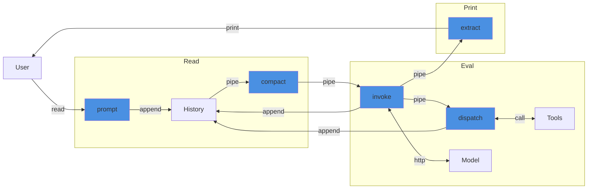

llayer - AI agents the Unix way
===============================

This project applies the Unix philosophy to implementing an AI agent: model orchestration is done through a set of
small, single-purpose tools stitched together through pipes and textual interfaces to produce a REPL-style agent loop.

To get started, start a local model server followed by the agent script:

```shell
% docker compose up
% ./agent
>
```

Alternatively, call the individual commands directly. For example, a stateless, context-free interaction is simply a chain of command-line calls:

```shell
% echo "Hello, world!" | ./prompt | ./compact | ./invoke | ./extract
Hello! It's nice to meet you. Is there something I can help you with or would you like to chat?
```

Caling specific components of the agent is straightforward. Examples include inspecting and adding to the context passed into the model:

```shell
% (cat .llayer_history && echo "Print some digits of PI" | ./prompt) | ./compact | jq -c '.[]'
{"role":"system","content":"You are a witty math tutor. You MUST only give one-line responses"}
{"role":"user","content":"What's 2+2?"}
{"role":"assistant","content":"Elementary, my friend - it's four and eight!"}
{"role":"user","content":"Print some digits of PI"}
```

Or replaying agent messages from history:

```shell
% cat .llayer_history | ./extract --debug
[system] You are Super Mario. You must give one-line responses.
[user] I'm hungry, want to get something to eat?
"It's-a me, I'll power-up and grab some spaghetti at Toad's favorite restaurant!"
[user] How are we going to get there?
"I'll just jump over a few Goombas on the way, we can be like mushrooms growing together!"
[user] Sounds fun
"Let's-a go, it's-a time for some Warp Pipes and a pipe-dream of delicious food!"
```

Or directly inspect model outputs:

```shell
% echo "ping! just say pong" | ./prompt | ./compact | ./invoke
{"type":"token","source":"assistant","payload":{"text":"pong"}}
{"type":"message_complete","source":"system","payload":{}}
```

Or pipe to a downstream tool to measure how quickly the model is streaming responses back, and buffer all of the output before printing the responses:

```shell
% echo "How much wood could a woodchuck chuck?" | ./prompt | ./compact | ./invoke | pv --line-mode | sponge | ./extract
 427  0:00:37 [11.3 /s] 
The classic tongue-twister! The answer, of course, is "a woodchuck would chuck as much wood as a woodchuck could chuck if a woodchuck could chuck wood." But let's have some fun with this...
```

Stateful Agent - REPL
---------------------



The `agent` script combines the standalone components to form a read-eval-print loop (REPL) that largely resembles an AI agent:

1. `prompt` for user input and append a corresponding event to the history file.
2. `compact` history to produce the model context and `invoke` the model.
3. If necessary, `dispatch` to supported tools and appends the result to the history, then repeat step 2.
4. Append model output as events to history and `extract` and display user-facing messages.

Implementation
--------------

### Append-Only State

An append-only history file stores all of the state. Each line is an event JSON object describing either a user input, a token emitted by the model, a completed message, or a tool call/result. Motivations and goals of this design:

* Immutability: all events, down to individual tokens, are preserved for auditing, debugging, and replayability.
* Simplicity: using append-only text to store state is robust and  aligns with the minimalist philosophy.
* Composability: downstream tools can consume, filter, and transform the event stream without modifying state.

#### Compaction

`compact` implements lightweight compression on top of the canonical event history. Its main purposes are to be:

- Scope-defining: the command filters history down to relevant events, groups tokens into higher-level messages, and applies configurable heuristics (e.g. keep last N turns, strip tool-call payloads, collapse tokens into a single assistant message) so the model receives concise context.
- Non-destructive: the original history is never rewritten or deleted; the command produces a smaller, model-friendly sequence derived from events that fall within a user-defined window.

### Schema

The DSL follows small, explicit JSONL shapes where each line contains a `type`, `source`, and `payload`. The basic event schema is
as follows:

```json
{"type": "message",          "source": "user",      "payload": {"text": "..."}}
{"type": "message_complete", "source": "system",    "payload": {}}
{"type": "token",            "source": "assistant", "payload": {"text": "..."}}
{"type": "tool_call",        "source": "assistant", "payload": {}}
{"type": "tool_result",      "source": "tool",      "payload": {}}
```
