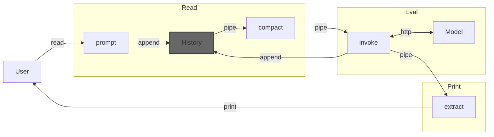

llayer - AI agents the Unix way
===============================

This is a minimal implementation of an interactive AI agent that applies the Unix philosophy to model orchestration: small, single-purpose tools stitched together through pipes and textual interfaces to implement a REPL-style agent loop.

A barebones, stateless, and context-free interaction is simply a chain of command-line calls:

```
% echo "Hello, world!" | ./prompt | ./compact | ./invoke | ./extract
Hello! It's nice to meet you. Is there something I can help you with or would you like to chat?
```

Stateful Agent (REPL)
---------------------



The `agent` script combines a few of the standalone components to form a read-eval-print loop (REPL) that largely resembles modern agents:

1. `prompt`s for user input and appends a formatted event to the history file.
2. `compact`s history to produce the model context and `invoke` to stream the model output.
3. Append streamed events to history and `extract` the model output.

```
% ./agent           
> Hello, world
Hello! It's nice to meet you. Is there something I can help you with or would you like to chat?
> Let's chat
We can have a conversation on any topic that interests you. What would you like to talk about?
```

Implementation
--------------

### Event Sourcing

An append-only history file serves as the canonical state store. Each line is an event JSON object describing either a user input, a token emitted by the model, a completed message, or a tool call.

Motivations:

* Immutability: every token and event is preserved for auditing, debugging, and replayability.
* Simple persistence: appending lines to a text file is robust and aligns with the minimalist philosophy.
* Composability: downstream tools can consume, filter, and transform the event stream without rewriting history.

#### Schema

We follow a small, explicit JSONL shape where each line contains a `type` and `payload`. Example events you will see in `history.jsonl`:

```json
{"type": "message", "source": "user", "payload": {"text": "Hello"}}
{"type": "token", "source": "assistant", "payload": {"text": "Hi"}}
{"type": "message_complete", "source": "system", "payload": {}}
```

#### Compaction

`compact` implements lightweight compression on top of the canonical event history. Namely:

- Non-destructive: `compact` does not rewrite or delete the original history; it produces a smaller, model-friendly sequence derived from recent events.
- Role: it selects relevant events, groups token streams into higher-level messages, and applies configurable heuristics (e.g. keep last N turns, strip tool-call payloads, collapse tokens into a single assistant message) so the model receives concise context.
- Purpose: reduce prompt size and convert token-granular stream logs into coherent message blocks suitable for the LLM.

License
-------

MIT
