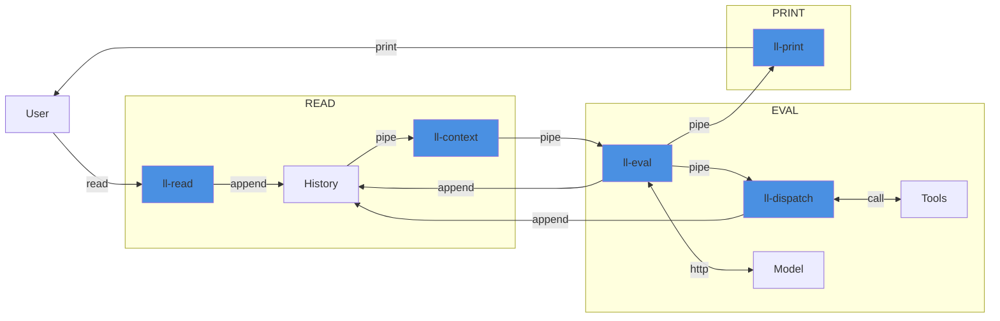

llayer - AI agents the Unix way
===============================

**The Journey to Dependency Zero Intelligence. Build AI agents with just `bash`, `curl`, and `jq`**

`llayer` is an experiment in applying the Unix philosophy to large language model orchestration. Everything is handled
through a suite of small, single-purpose commands interfacing over standard text pipes to produce a REPL-style agent
loop.

Popular agent frameworks can be state-heavy and hard to reason about, making it difficult to audit and inspect the inputs and
outputs at various stages. `llayer` aims to deconstruct the agent lifecycle into traditional Unix concepts while
demystifying the internals into fundamentals:

* **State and Memory**: an append-only history file (think `.bash_history`)
* **Context Window**: a `jq` stream reducer
* **Agent Loop**: a while loop in `bash`

Quick Start
-----------

To get started, run a local model server (Ollama) with `docker compose up` then invoke the individual commands. For
example, a stateless, context-free call is simply a chain of command-line tools:

```shell
% echo "Hello, world" | ./ll-read | ./ll-context | ./ll-eval | ./ll-print
Hello! It's nice to meet you. Is there something I can help you with or would you like to chat?
```

Alternatively, use the `agent` script for an interactive session:

```shell
% ./agent 
> Hello there, good evening.
How can I assist you tonight?
```

The Stateful Agent: a REPL
--------------------------



The `agent` script combines the standalone components to form a read-eval-print loop (REPL) that largely resembles an AI agent:

1. `ll-read` user input and append a corresponding event to the history file.
2. Build `ll-context` from history to produce the model context and `ll-eval` the model.
3. If necessary, `ll-dispatch` to supported tools and append the result to the history; repeat step 2.
4. Append model output as events to history then `ll-print` to display messages to the user.

The Power of Pipes
------------------

Caling specific components of the agent is straightforward. Examples include inspecting and adding to the context passed into the model:

```shell
(cat .llayer_history && echo "Print some digits of PI" | ./ll-read) | ./ll-context | jq -c '.[]'
```

Or replaying agent messages from history:

```shell
cat .llayer_history | ./ll-print --debug
```

Or directly inspect streamed model outputs:

```shell
echo "ping! just reply pong" | ./ll-read | ./ll-context | ./ll-eval            
```

Or pipe to a downstream tool to measure how quickly the model is streaming responses back, and buffer all of the output before printing the responses:

```shell
echo "How much wood could a woodchuck chuck?" | ./ll-read | ./ll-context | ./ll-eval | pv --line-mode | sponge | ./ll-print
```

Implementation
--------------

### Append-Only State

An append-only history file stores all of the state. Each line is an event JSON object describing either a user input, a token emitted by the model, a completed message, or a tool call/result. Motivations and goals of this design:

* Immutability: all events, down to individual tokens, are preserved for auditing, debugging, and replayability.
* Simplicity: using append-only text to store state is robust and  aligns with the minimalist philosophy.
* Composability: downstream tools can consume, filter, and transform the event stream without modifying state.

### Context Building

`ll-context` compacts the canonical event history to build the context for each model call. Its main purposes are:

- Scoping: the command filters history down to relevant events, groups tokens into higher-level messages, and applies configurable heuristics (e.g. keep last N turns, strip tool-call payloads, collapse tokens into a single assistant message) so the model receives concise context.
- Reduction: the original history is never rewritten or deleted; the command reduces the history down to a filtered, model-friendly sequence derived from events that fall within a user-defined window.

### Schema

The individual components utilize a DSL that follows minimal, explicit JSONL shapes where each line contains a `type`, `source`, and `payload`. The basic event schema is as follows:

```json
{"type": "message",          "source": "user",      "payload": {"text": "..."}}
{"type": "message_complete", "source": "system",    "payload": {}}
{"type": "token",            "source": "assistant", "payload": {"text": "..."}}
{"type": "tool_call",        "source": "assistant", "payload": {}}
{"type": "tool_result",      "source": "tool",      "payload": {}}
```
